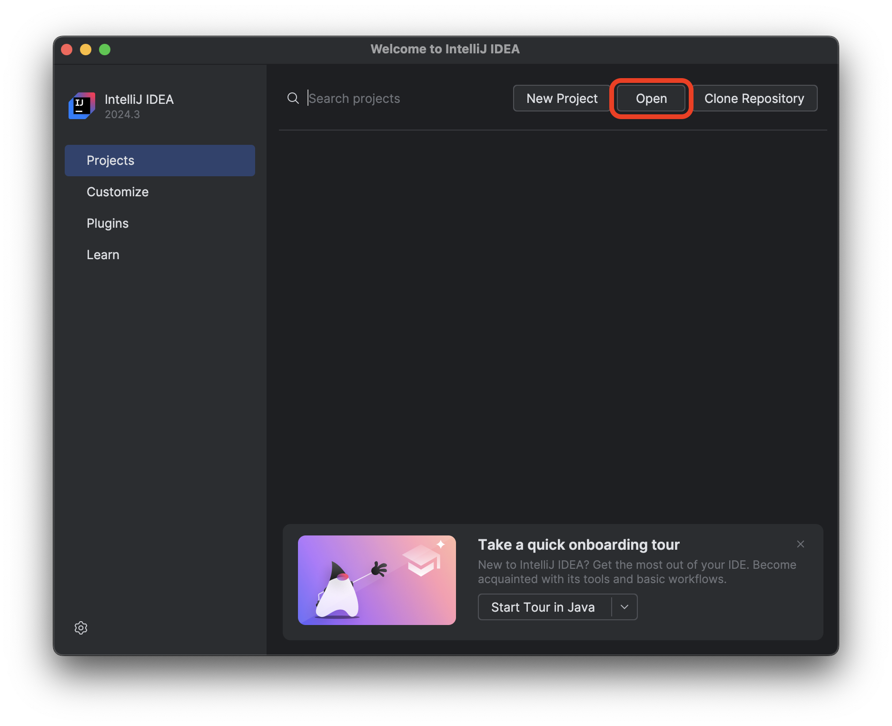

<h1>
  <span class="headline">Stacks and Queues in Java Lab</span>
  <span class="subhead">Setup</span>
</h1>

## Step 1:


Open your Terminal application and navigate to your <code class="filepath">~/code/ga/labs</code> directory:

```bash
cd ~/code/ga/labs
```

## Step 2: Clone a local copy of the starter code

Clone a copy of [Stacks and Queues in Java Lab Starter](https://git.generalassemb.ly/modular-curriculum-all-courses/stacks-and-queues-in-java-lab-starter) repository locally by using the `git clone` command:

```bash
git clone https://git.generalassemb.ly/modular-curriculum-all-courses/stacks-and-queues-in-java-lab-starter stacks-and-queues-in-java-lab
```
> 💡 The `stacks-and-queues-in-java-lab` at the end of this command will place the contents of the `stacks-and-queues-in-java-lab-starter` repo into a directory named <code class="filepath">stacks-and-queues-in-java-lab</code>.

Move into the <code class="filepath">stacks-and-queues-in-java-lab</code> directory:

```bash
cd stacks-and-queues-in-java-lab
```

You don't want GA commits on your work. So remove the existing Git information from this starter code:

```bash
rm -rf .git
```

## Step 3: Configure for using your personal GitHub account
Before getting this repository to your GitHub account, re-initialize it as a new Git repository:

```bash
git init
git add .
git commit -m "initial commit"
```

Make a new repository on your personal [GitHub](https://github.com/) account named `stacks-and-queues-in-java-lab`.

Link your local Git repo to your remote GitHub repo:

```bash
git remote add origin https://github.com/<github-username>/stacks-and-queues-in-java-lab.git
git push origin main
```

<blockquote class="warning">
  🚨 Do not copy the above command. It will not work. Your GitHub username will replace <code>&lt;github-username&gt;</code> (including the <code><</code> and <code>></code>) in the URL above.
</blockquote>

## Step 4: Launch the lab starter code in IntelliJ IDEA

Open IntelliJ IDEA Community Edition and open the project by selecting the `Open` option on the launch screen as outlined in red below.



Next, navigate to and select the `stacks-and-queues-in-java-lab` directory you just created and open the project.

Trust the project if you are prompted.

## Running the tests

This lab includes a set of tests to help you verify your work. To run the tests, right-click on the <code class="filepath">src/test/java</code> directory and select **Run 'All Tests'**.